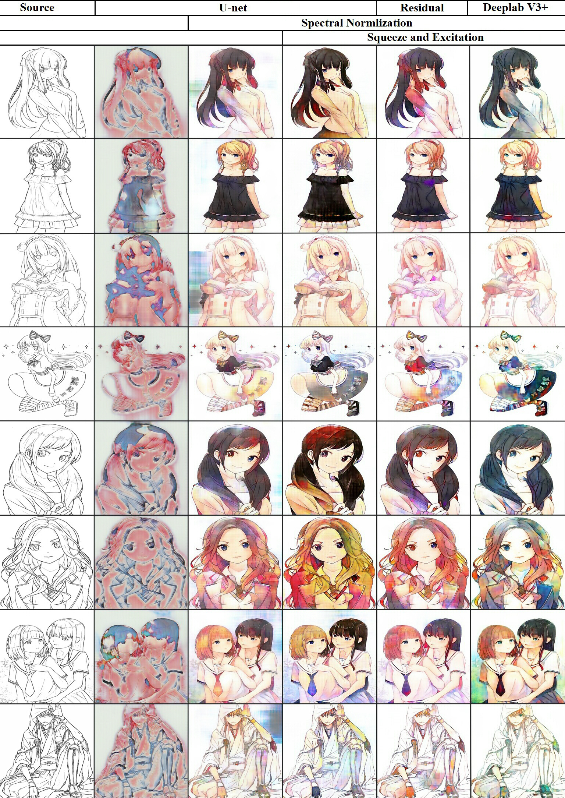

"# Outline_colorization" 
TensorFlow implementation of U-net | Resdiual U-net | DeeplabV3+ that compare the differences between difference structures for 
Outline colorization works.

Here are some result in our test:



## Setup

### Prerequisites
- Windows
- Tensorflow 1.6.0
- Python 3.6.4
- NVIDIA GPU 1080ti

### Dataset
 We got 110000 anime-style images from the internet.(We will upload later) 

### Parameter
- epoch 20
- Learning rate 0.0005
- Batch size 10
- Image size 256x256

### How to use
- For training
``` bash
python main.py --network (U_net | Res_U_net | DeeplabV3_Plus)
``` 

- For testing
```bash
python main.py --training False --network (U_net | Res_U_net | DeeplabV3_Plus)
``` 

### Train 
Sample will save in the ```./sample``` and each time you will get an number of images according to the bacth size.

### Test
Put the images which you want to test in the ```./test``` and you will git the result in the ```./result```.
